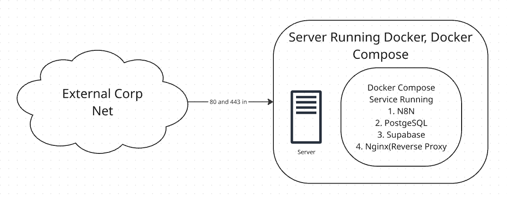

# N8N & Supabase Deployment with Docker Compose

This project provides a deployment setup for [n8n](https://n8n.io/) and [Supabase](https://supabase.com/) using Docker Compose, with [NGINX](https://nginx.org/) as a reverse proxy.

| Component | Version  |
| --------- | -------- |
| n8n       | ` 2.2.4` |
| Qdrant    | `1.16.3` |

## Features

- Automated environment file creation
- Easy startup and management scripts
- NGINX reverse proxy configuration
- Docker Compose orchestration for n8n and Supabase

## Basic Architecture Layout



## Prerequisites

- [Docker](https://docs.docker.com/get-docker/)
- [Docker Compose](https://docs.docker.com/compose/)
- [Python 3.12+](https://www.python.org/)
- [UV (from Astral)](https://github.com/astral-sh/uv) (for running Python scripts)

## Usage

1. **Clone the repository**

   ```bash
   git clone <repo-url>
   cd prod_n8n
   ```

2. **Create the environment file**

   - When running the environment creator, you'll be asked to supply domains for supabase and N8N. Remember these as they'll need matching certs below. Especially if you're creating test certs. Lets assume the domains will be **https://n8n.mydomain.com** and **https://supabase.mydomain.com**

   ```bash
   uv run create_env.py
   ```

3. **Create or supply your SSL certs.**

   - You can create test certs for your domain using the below code.

   ```bash
   openssl req -x509 -nodes -days 365 \
   -newkey rsa:2048 \
   -keyout nginx/certs/privkey.pem \
   -out nginx/certs/fullchain.pem \
   -subj "/CN=*.mydomain.com"

   ```

- Review the nginx conf file inside of **./nginx/nginx.conf** to validate or set your hostnames for Supabase and N8N and confirm the cert names

3. **Start all services**

   ```bash
   uv run start_all.py
   ```

4. **Access your services**
   If you're running locally with the self signed cert on your workstation, you can add the domains you created to your host file so that you can use them during your testing.

   For actual domains and the Nginx proxy, this guide assumes you know how to create and provision certs for use with NGINX but you're more than welcome to modify and use a reverse proxy of your own choosing, or just access the endpoints directly from the host.

   In a more production environment it is best to only expose the services liek Qdrant, N8N, and supabase to a proxy and not access or interact with these resources directly as there are a multitude of security concerns.

   - n8n: [https://n8n.mydomain.com](https://n8n.mydomain.com)
   - Supabase: [https://supabase.mydomain.com](ttps://supabase.mydomain.com)

## Creating Supabase creds inside of N8N.

To use Supabase you need to create a credential inside of N8N for your users to utilize.

1. Take the **SERVICE_ROLE_KEY** from the created **.env** file and log into N8N.
2. From the homepage, click the down arrow next to the right of **Create Workflow** and select **Create Credential**
3. Search for **Supabase API** in the menu that appears.
4. For the host use the internal docker hostname **http://kong:8000** and paste in the **SERVICE_ROLE_KEY**
5. Give the credential a meaningful name at the top and save the credential.

## Creating Qdrant creds inside of N8N.

1. Take the **QDRANT**SERVICE**API_KEY** from the created **.env** file and log into N8N
2. From the homepage, click the down arrow next to the right of **Create Workflow** and select **Create Credential**
3. Search for **Qdrant** in the menu that appears.
4. For the host use the internal docker hostname **http://qdrant:6333** and paste in the **QDRANT**SERVICE**API_KEY**
5. Give the credential a meaningful name at the top and save the credential.

## Folder structure

```bash
.
├── create_env.py
├── docker-compose.yml
├── file.json
├── init-data.sh
├── n8n_extras
│   └── n8n-task-runners.json
├── nginx
│   ├── certs
│   ├── nginx.conf
│   └── nginx.conf.j2
├── pyproject.toml
├── README.md
├── readme_parts
│   └── basic_diagram.png
├── start_all.py
```
